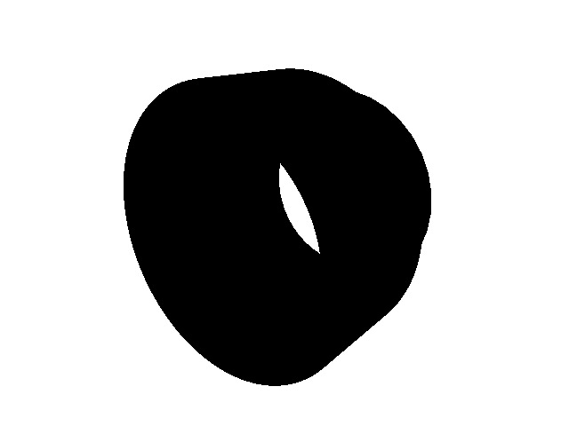
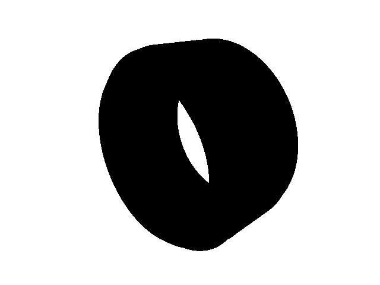
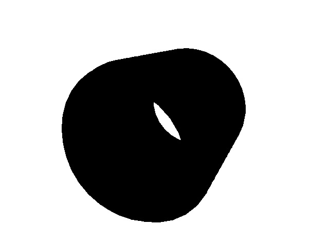
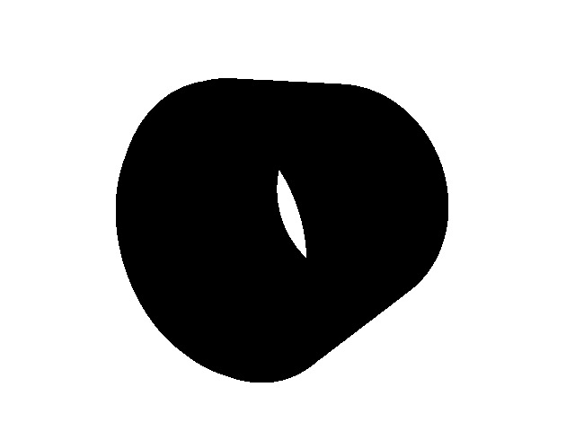
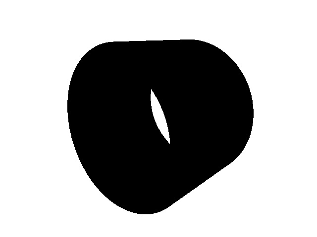

## Hose and valve adapters

Below is a selection of 3D printed adapters I have used

Printed with ABS filament and a 0.8mm nozzle for durability

- 1/2" female to 1/2" female

    

- 1/2" female to 3/4" female

    

- 1/2" female to 3/4" male

    

- 1/2" male to 1/2" male

    

- 3/4" male to 3/4" male

    

- 3/4" female to 3/4" female

    
