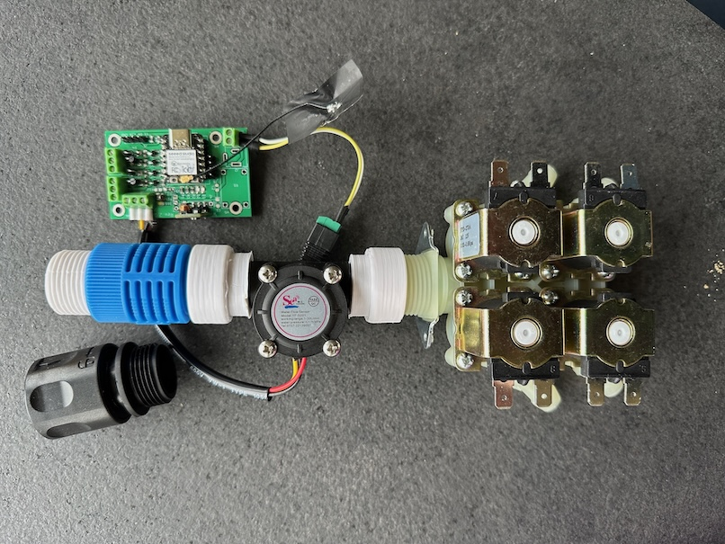
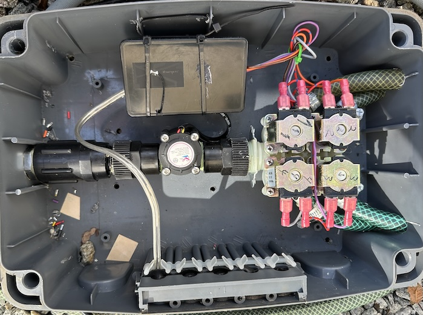
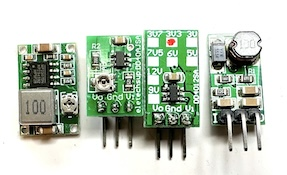
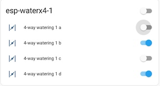
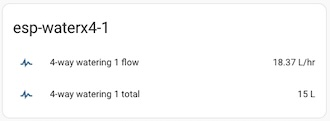
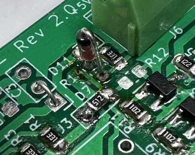

# Valve Controller X4

Work in progress / still a prototype...

A DYI 4x valve controller based on ESP32c3. This device is mainly intended for irrigation control, typically using 12V solenoid valves. You can also use ball valves with automatic return on power off.

This board is tested with ESPhome and ESPEasy [firmware](#firmwares) (build instructions below), and is easily used with home automation systems that support MQTT auto discovery, the native Home Assistant API, and the many [controllers that ESPEasy supports](https://espeasy.readthedocs.io/en/latest/Controller/_Controller.html)

## Introduction

Some of the main features and benefits

- **4x outputs**
    - For controlling up to four valves at a time
    - Each valve should draw less than 1A - or you can add to the PCB trace thickness using wire
- **Flow sensor input**
    - A flow sensor input is available
    - Can be open collector / hall sensor. Pulled up to 3.3V level internally. 5V supply on terminal
- **I2C support**
    - An I2C pin header with power supply is available to use with I2C sensors
    - ... or you can use the same GPIO pins for any other purpose of your choise
- **WiFi based**
    - This is almost a must have for most home automation systems
    - OTA support
    - Configuration backup, restore and bulk updates.
- **Firmware of your choise**
    - ESPEasy with Domoticz over http. Device creation uses virtual sensors
    - ESPEasy with Domotics and Home Assistant via MQTT. Device creation uses a MQTT configuration text file.
    - ESPHome to Home Assistant via MQTT and auto discovery
    - ESPHome to Domoticz via MQTT and auto discovery
    - ... and as the hardware supports using both Arduino and ESP-IF development kits, almost any other firmware can be created.
- **Seed Studio XIAO ESP32C3**
    - This device is shielded and comes with an external IPX antenna connector
    - FCC and CE regulations approved

## Setup and mounting

The main parts includes a simple flow sensor and a pressure reduction:

<p align="center">
    
</p>

The adapter parts are [3D prints](./FreeCAD/)

I use a long box with a closing / latched lid. This is designed for outdoor use. Will tolerate rain, but not frost.

<p align="center">
    
</p>

Please note the bottom holes. In case water is leaked, it has a way to drain out of the box

## Indicators

Each of the four valve outputs has a LED indicator at the back of the PCB

- LED D11 will indicate low level input from the flow meter
- LED D1
  - no change indicates out of power, device death/freeze or other
  - a duty cycle 1:1 will indicate a reset is ongoing
<!--
  - will blink with a duty cycle 1-4 or 4-1 to indicate valve closed or open
-->

## Implementation and design

The schematic diagram is [available here](KiCad/WaterValveX4-schema-2.0.1.pdf). The [KiCad EDA](https://www.kicad.org/) project is in the [same folder](./KiCad)

### GPIO pin usage

| PIN      | Capabilty          | Function                            |
|----------|--------------------|-------------------------------------|
| GPIO2    | Acticve low output | LED D2 - not used                   |
| GPIO3    | Active high output | Valve 1                             |
| GPIO4    | Active high output | Valve 2                             |
| GPIO5    | Active high output | Valve 3                             |
| GPIO6    | I2C                | SDA                                 |
| GPIO7    | I2C                | SCL                                 |
| GPIO8    | Active high output | Valve 4                             |
| GPIO9    | Active low out     | Status LED                          |
| GPIO10   | Pulled up input    | Flow meter input                    |
| GPIO20   | RX / 1-wire        | Serial or 1-wire sensor             |
| GPIO21   | TX / 1-wire        | Serial or 1-wire sensor             |


## Hardware - getting started

This project uses my [KiCad-lib-ESP32 repository](https://github.com/hansrune/KiCad-lib-ESP32.git) as a [git submodule](https://www.git-scm.com/book/en/v2/Git-Tools-Submodules). To check this out, use the following:

```bash
git clone --recurse-submodules https://github.com/hansrune/WaterValveX4.git 
```

### Materials used

This project uses the [Seed Studio XIAO ESP32C3 RISC-V module](https://www.seeedstudio.com/Seeed-XIAO-ESP32C3-p-5431.html). This tiny device has proven to be more reliable than most ESP8266 modules used in earlier versions. This module also comes with an IPX connector for connecting an external antenna, and is delivered with a simple external antenna for good range. This device is also EMI shielded and certified.

<!--
A ball valve like [these HSH-FLO valves](https://www.ebay.com/itm/121728665101?var=420727385309) uses metal gears, and also have a manual override possibility. Despite the moderate cost, I have found them very reliable. Manufacturer claims 100k operations. I typically use a 2 or some times 3-port version, size 3/4" DN20, DC12/24V and with CR05-01 wiring, including a manual overrride whell option.
-->
A 4x valve like [these](images/Valve4x.png) attached with a washing machine attachment hose. A selection of 3D printable (STL and FreeCAD) adapters is available [here](./FreeCAD/)

Any available 12V DC power supply delivering 2A or more should do for the control board and the valves.

There are many options and possible pinouts for DC-DC converters for the 12V to 5V conversion. A linear regulator (L7805) will need a heatsink, so a DC-DC converter is recommended.

<p align="center">
    
</p>

The MOSFETs need a low Vgs trigger voltage, i.e. well under 3V on full load. I have used Si2302/N025P for the N-channel, SOT-23 package.

Resistors are 0805 size. Screw terminals are 3.5mm, which is a tight fit when ferrules are being used.

For more information, use [this KiCad BOM](KiCad/WaterValveX4-BOM.csv)

## Hardware assembly

Soldering a prototype by hand is possible if you have a steady hand and a small solder iron tip. A microscope is recommended to inspect the solder joints properly.

Recommend to do the SMD parts first, then other components. 

### Hardware tests

You should test at least the following **before adding the ESP32 module**:

- Attach a battery and check that the valve can be operated both NO and NC
- Add power and check that 5V conversion is OK
- Apply 5V to GPIO 1, 5, 3 and 8 in turn to check that the output works with the indicators at the PCB back side

## Firmwares

### ESPHome

ESPHome firmware can be set up from [this ESPHome configuration repository](https://github.com/hansrune/esphome-config) using the `test_waterx4.yaml` file as a template

Follow the [README](https://github.com/hansrune/esphome-config) for instructions on what you will likely want to change.

By default, MQTT auto discovery is being used. This should work out of the box with Home Assistant, Domoticz and other that support [Home Assistant MQTT Auto Discovery](https://www.home-assistant.io/integrations/mqtt/#mqtt-discovery)

In Home Assistant, the device has these controls. Valves are labelled a, b, c and d. The -1 is the controller instance

<p align="center">
    
</p>

... and flow sensor / total counter:

<p align="center">
    
</p>

### ESPEasy

ESPEasy can be used with a number of different controllers / home automation systms. A custom firmware build description is [available here](https://github.com/hansrune/ESPEasy-custom/blob/builds/custom/mega-20240822-1/README-custombuilds.md)

ESPEasy requires many settings. For configuration settings and rule files, you can upload the files from [this page](./ESPEasy/) as a starting point. Please make sure to change name, unit number, controller IP addresses, NTP, syslog host and latitude/longitude. This configuration uses both a MQTT controller and a Domoticz controller. Change to what you need.

## Bugs and tweaks

Version 2.0 of the PCB needs the flow sensor input components mounted as shown:

<p align="center">
    
</p>

- A 1N4148 diode replaces R14 - cathode faces terminal connector
- A 5.1 kohm resistor replaces D7 - for a pull-up
- R12 is not mounted

<!-- 

## How to contribute

-->

## Licensing

This project is licensed under the [GNU General Public License v3.0](GNU-LICENSE-V3.txt) for the software, [CERN-OHL-W](OHL-LICENSE.txt) for the hardware, and [CC BY-SA](CC-BY-SA-LICENCE.txt) for the documentation and ideas.

<p align="center" width="100%">
    
</p>

<!-- 
| **Open Source Licenses** |                                                       |
| -------------------------|-------------------------------------------------------|
| Hardware                 | [CERN-OHL-W](OHL-LICENSE.txt)                         |
| Software                 | [GNU General Public License v3.0](GNU-LICENSE-V3.txt) |
| Documentation / idea     | [CC BY-SA](CC-BY-SA-LICENCE.txt)                      |
-->
